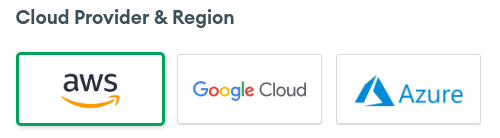
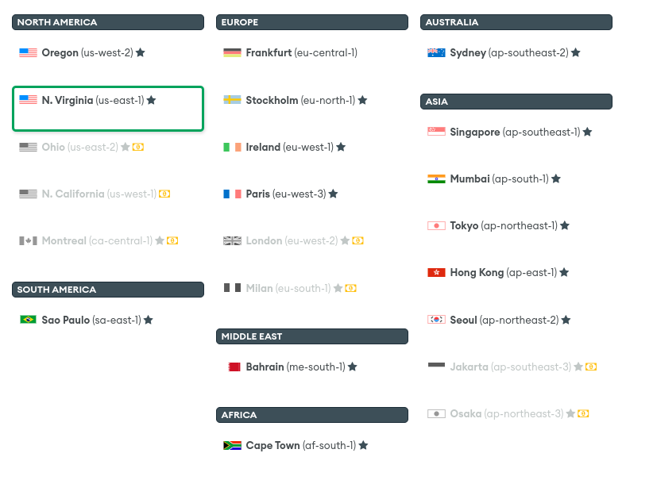
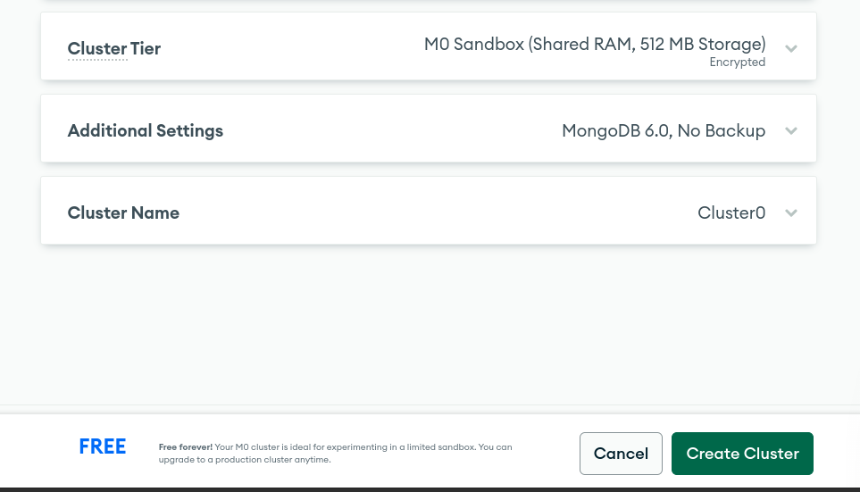
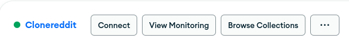
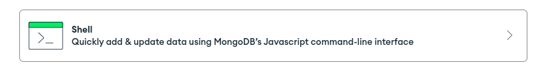
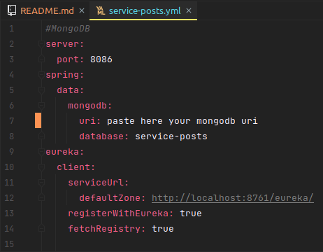
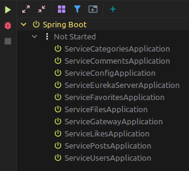

<div align="center">
    <h1>Clone Reddit Service</h1>
    
</div>

## Purpose

The purpose of this project is to demonstrate my knowledge in the spring framework with microservices among other technologies that will be implemented in the following project

## Description
This project is a clone of the most famous blogging platform "Reddit" replicating some aspects of it and developing it in microservices.

## Installation

### Clone the repository
    
```shell
git clone git@github.com:CristianDavidVB/clone-reddit-service.git

cd clone-reddit-service
```

## Requirements

- [JDK 17](https://adoptium.net/temurin/releases/)
- Maven
- Postgresql
- Mysql
- MongoDB

## Docker
[Docker](https://www.docker.com/) you must modify the words between <>

Container Posgresql

- Write in bash
```shell
docker run --name <Here is the container name> -e POSTGRES_USER=<Your_User> -e POSTGRES_PASSWORD=<Your_Password> -p <other number>:5432 -d postgres:14
```
Container MySQL
- Write in bash
```shell
docker run --name <Here_is_the_container_name> -e MYSQL_ROOT_PASSWORD=<Your_Password> -p <Other_number>:3306 -d mysql:8
```
## MongoDB
[MongoDB](https://www.mongodb.com/)

### Steps to connect to mongoDB
- Click here


- This option that is free


- Any of these 3 options



- Choose the one with the lowest latency



- Click Create Cluster



Click to Browse Collections



- Click Collections and Create Database


- Name database


- Click Conection


- Click Shell



- Copy the connection


- Added file service-posts.yml



## Running the application locally

Order to execute the services

- ConfigApplication
- EurekaApplication
- Any service except gateway
- GatewayApplication

